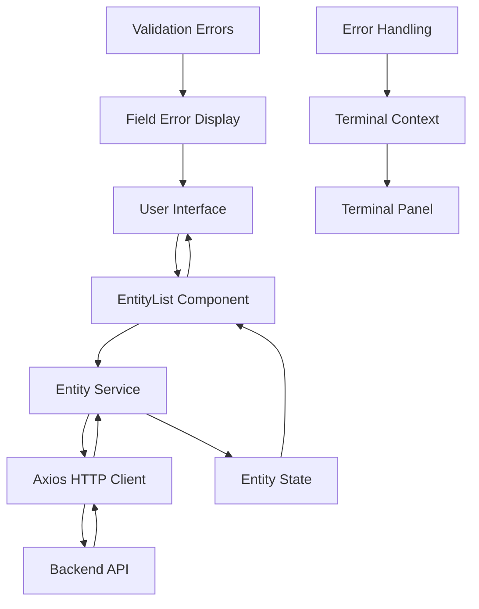
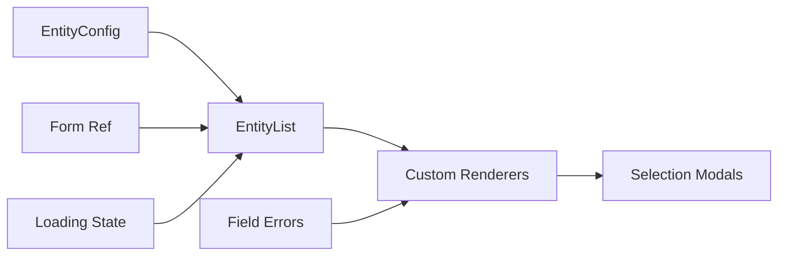

# Estopia Web - Frontend Architecture

## Overview
Estopia Web is a React TypeScript application for property management, providing CRUD operations for contracts, payments, clients, and assets with a generic entity management system.

## Technology Stack

### Core Technologies
- **React 18.3.1** - UI Library
- **TypeScript** - Type safety and development experience
- **Vite 7.0.4** - Build tool and development server
- **Ant Design 5.26.6** - UI Component library

### Additional Libraries  
- **Axios 1.10.0** - HTTP client for API communication
- **Day.js 1.11.13** - Date manipulation and formatting
- **Lucide React 0.525.0** - Icon library

## Project Structure

```
src/
├── components/           # React components
│   ├── common/          # Shared components
│   │   ├── SelectionModal.tsx
│   │   ├── ClientSelectionModal.tsx
│   │   └── AssetSelectionModal.tsx
│   ├── generic/         # Generic/reusable components
│   │   └── EntityList.tsx
│   ├── AssetList.tsx    # Entity-specific lists
│   ├── ClientList.tsx
│   ├── ContractList.tsx
│   └── PaymentList.tsx
├── config/              # Configuration files
│   └── entities/        # Entity configurations
├── constants/           # Column definitions
├── context/             # React contexts (Theme, Terminal, Error)
├── hooks/              # Custom React hooks
├── pages/              # Page components
├── services/           # API services
├── theme/              # Theme and styling
├── types/              # TypeScript type definitions
│   ├── entity/         # Entity-related types
│   └── models.ts       # Data models
└── utils/              # Utility functions
```

## Architecture Patterns

### Generic Entity Management System
The application uses a generic pattern for CRUD operations:

```typescript
interface EntityConfig<T, CreateT, UpdateT> {
  name: string;
  pluralName: string;
  columns: EntityColumnConfig<T>[];
  service: EntityService<T, CreateT, UpdateT>;
  createEmpty: () => T;
}
```

### Component Architecture
- **EntityList**: Generic table component with inline editing
- **SelectionModal**: Generic modal for entity selection
- **Custom Renderers**: Field-specific rendering logic

### State Management
- React Context for global state (Theme, Terminal, Error)
- Local component state for entity management
- No external state management library (Redux/Zustand)

## Data Flow



## Key Features

### Generic CRUD System
- Type-safe entity management
- Configurable columns and validation
- Inline editing with smart save/cancel logic
- Error handling with field-level validation display

### Internationalization Ready
- Error message handling from backend
- Locale-based date formatting
- Expandable for multi-language support

### UI/UX Features
- Responsive design with Ant Design
- Real-time validation feedback
- Selection modals for foreign key relationships
- Terminal panel for operation feedback

## Component Communication

### Props Flow


### Context Usage
- **ThemeContext**: UI theming and preferences
- **TerminalContext**: Operation feedback and logging
- **ErrorContext**: Global error handling

## Build & Development

### Scripts
- `npm run dev` / `npm run start-web` - Development server
- `npm run build` - Production build
- `npm run lint` - Code linting
- `npm run type-check` - TypeScript checking

### Configuration
- **Vite config**: Build optimization and development server
- **TypeScript config**: Strict type checking
- **ESLint config**: Code quality rules

## API Integration

### Service Layer
```typescript
interface EntityService<T, CreateT, UpdateT> {
  getAll(params?: FilterSortParams): Promise<T[]>;
  create(data: CreateT): Promise<T>;
  update(id: number, data: UpdateT): Promise<T>;
  delete(id: number): Promise<void>;
}
```

### Error Handling
- Backend error mapping to field-level validation
- Custom error display with internationalized messages
- Terminal feedback for user operations

## Future Considerations

### Scalability
- Generic system supports easy addition of new entities
- Type-safe configuration prevents runtime errors
- Modular architecture allows feature expansion

### Performance
- Lazy loading potential for large datasets
- Memoization in place for expensive operations
- Vite's fast HMR for development experience