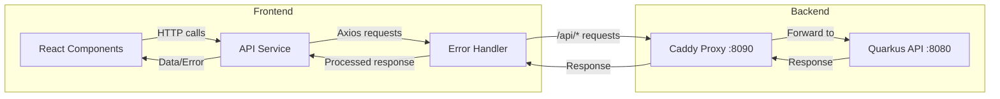

# Estopia Web Frontend Architecture

## High-Level Architecture

The Estopia Web frontend is a modern React application built with TypeScript and Vite, following component-based architecture patterns with clean separation of concerns.

## Application Architecture

### Component Hierarchy

```
┌─────────────────┐
│      App        │ ← Root component, routing, global state
├─────────────────┤
│     Layout      │ ← Navigation, header, sidebar, main content area
├─────────────────┤
│   Page Routes   │ ← Dashboard, Users, Clients, Assets, etc.
├─────────────────┤
│   Components    │ ← Reusable UI components (forms, tables, modals)
├─────────────────┤
│    Services     │ ← API communication, data fetching
├─────────────────┤
│     Utils       │ ← Helpers, formatters, validators
└─────────────────┘
```

### Directory Structure

```
src/
├── components/              # Reusable UI components
│   ├── generic/            # Generic components (EntityList, forms)
│   ├── layout/             # Layout components (Header, Sidebar)
│   ├── UserList.tsx        # Domain-specific components
│   └── ClientSelector.tsx
├── constants/              # Configuration and constants
│   ├── userColumns.tsx     # Table column definitions
│   └── apiRoutes.ts        # API endpoint constants
├── config/                 # Application configuration
│   └── entities/           # Entity configurations
│       ├── userEntity.ts
│       └── clientEntity.ts
├── services/               # API communication
│   ├── api.ts              # Main API service
│   └── auth.ts             # Authentication service
├── types/                  # TypeScript type definitions
│   ├── models.ts           # Domain models
│   └── entity/             # Entity type definitions
├── utils/                  # Utility functions
│   ├── errors/             # Error handling utilities
│   └── formatters/         # Data formatting utilities
├── i18n/                   # Internationalization
│   └── i18n.ts             # Language configuration
└── styles/                 # Global styles and themes
```

## Security Architecture

### Authentication Flow
The frontend handles authentication through JWT tokens:

1. **Login Process**:
   - User submits credentials via login form
   - Frontend sends request to `/api/auth/login`
   - Backend validates and returns JWT token
   - Token stored in localStorage for subsequent requests

2. **Authenticated Requests**:
   - All API calls include `Authorization: Bearer <token>` header
   - Token automatically added by AxiosErrorHandler
   - Invalid/expired tokens trigger automatic logout

3. **Role-Based UI**:
   - Components conditionally render based on user role
   - ADMIN users see additional menu items and actions
   - USER role restricts access to client-specific data

### Security Features
- **No Client-Side Validation**: Frontend relies entirely on backend validation
- **Secure Token Storage**: JWT tokens stored in localStorage
- **Automatic Token Handling**: Centralized token management
- **CORS Compliance**: Proper cross-origin request handling

## Communication Architecture

### API Integration
All API communication goes through the centralized API service layer:



### Request Flow
1. **Component** initiates API call through service
2. **API Service** formats request with proper headers
3. **AxiosErrorHandler** processes request, adds authentication
4. **Caddy Proxy** routes request to backend
5. **Response** flows back through same chain with error handling

## Component Architecture

### Generic Components Pattern
The application uses generic components for common patterns:

```typescript
// Generic EntityList component handles CRUD operations
<EntityList config={userEntityConfig} />

// Entity configuration defines behavior
export const userEntityConfig: EntityConfig = {
  name: 'User',
  columns: USER_COLUMNS,
  service: userServiceAdapter,
  createEmpty: createEmptyUser,
};
```

### Column-Based Table System
Tables use a column configuration system for consistency:

```typescript
export const USER_COLUMNS: UserColumnConfig[] = [
  {
    key: 'username',
    title: 'Username',
    searchable: true,
    sortable: true,
    customRenderer: (record, editing) => {
      // Custom rendering logic
    }
  }
];
```

## State Management

### Local State Strategy
- **Component State**: React hooks (useState, useEffect) for local UI state
- **No Global State**: Application uses prop drilling and context where needed
- **Server State**: API responses cached temporarily in component state
- **Authentication State**: JWT token in localStorage, user info derived from token

### Data Flow
```
API Response → Component State → Props → Child Components → UI Updates
```

## Internationalization

### Multi-Language Support
The application supports multiple languages through react-i18next:

```typescript
// Language configuration
const resources = {
  en: { translation: { "nav.dashboard": "Dashboard" } },
  ro: { translation: { "nav.dashboard": "Tablou" } }
};

// Usage in components
const { t } = useTranslation();
<span>{t("nav.dashboard")}</span>
```

### Language Files Structure
- **English (en)**: Default language
- **Romanian (ro)**: Secondary language
- **Fallback**: Automatic fallback to English for missing keys

## Build and Deployment Architecture

### Development Environment
- **Vite Dev Server**: Hot reload, fast builds
- **Port 5173**: Default Vite development port
- **Proxy Integration**: Works with Caddy reverse proxy on port 8090
- **TypeScript**: Full type checking during development

### Production Build
- **Static Assets**: Optimized bundles with hash-based caching
- **Code Splitting**: Automatic code splitting for better performance
- **Tree Shaking**: Unused code elimination
- **Asset Optimization**: Minification, compression, image optimization

### Container Deployment
```dockerfile
FROM nginx:alpine
COPY dist/ /usr/share/nginx/html/
COPY nginx.conf /etc/nginx/nginx.conf
```

## Performance Considerations

### Optimization Strategies
1. **Code Splitting**: Lazy loading of routes and components
2. **Bundle Optimization**: Vite's rollup-based bundling
3. **Asset Caching**: Hash-based asset naming for cache busting
4. **API Caching**: Response caching in component state
5. **Image Optimization**: Compressed images, proper formats

### Loading States
- **Skeleton Loading**: Ant Design skeleton components during data fetch
- **Error Boundaries**: Graceful error handling for component failures
- **Progressive Enhancement**: Core functionality works, enhanced features layer on

## Testing Architecture

### Testing Strategy
- **Unit Tests**: Component logic and utility functions
- **Integration Tests**: API service layer testing
- **E2E Tests**: Puppeteer-based end-to-end testing
- **API Contract Tests**: Validation of API integration

### Test Structure
```
tests/
├── unit/                   # Unit tests for components
├── integration/           # API integration tests
├── e2e/                   # End-to-end tests
└── mocks/                 # Mock data and handlers
```

## Error Handling

### Centralized Error Management
```typescript
// AxiosErrorHandler processes all API errors
class AxiosErrorHandler {
  handleResponseError(error: AxiosError) {
    // Centralized error logging
    // User-friendly error messages
    // Automatic token refresh handling
  }
}
```

### Error Display Strategy
- **Toast Notifications**: Non-blocking error messages
- **Form Errors**: Inline validation error display
- **Page Errors**: Error boundaries for component failures
- **Network Errors**: Connection issue handling

This architecture ensures a maintainable, scalable, and secure frontend that integrates seamlessly with the Quarkus backend while providing an excellent user experience.